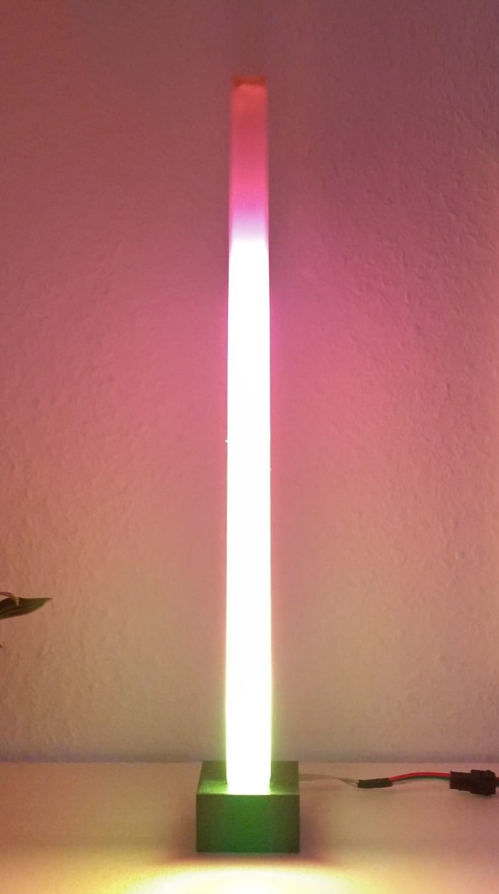
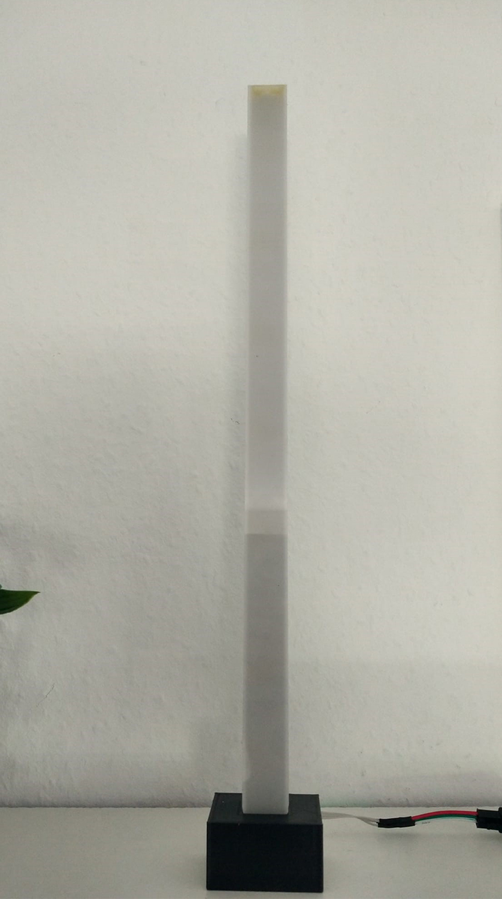

# Music-Reactive-Lamp

### This little project is a music reactive lamp based on an Arduino Nano 

  
  

## Parts:
- U-profile (at least 10mm width to fit the RGB-Strip)
- RGB-Strip WS2812 (for example: <a href="https://www.amazon.de/SEZO-Individuell-Adressierbar-Nicht-Wasserdicht-Inneneinrichtung/dp/B09N97D1J3/ref=sr_1_12">Here</a>)
- Diffusor, which goes onto the U-profile (make sure the width is the same as the width on the U-profile)
- Base (I simply 3D-printed it)
- You can also use an Aluminium-profile, for RGB-Strips for example <a href="https://www.amazon.de/-/en/Aluminium-profile-stripes-strips-dimensions/dp/B06XGF4QKN/ref=sr_1_5">this</a> one
- Arduino Nano
- For the music-input, I am using a 3.5mm jack, but you can also use a <a href="https://www.amazon.de/Youmile-Sensitivity-Microphone-Detection-Arduino/dp/B07Q1BYDS7/ref=sr_1_22_sspa">microphone</a>

## Info!
There are two folders in the src folder, one folder is called monoChannel, which is for a single Lamp and the other folder called stereoChannel is for two lamps, you can use two lamps, to visualize the audio played on the left channel separated from the audio played on the right channel.
